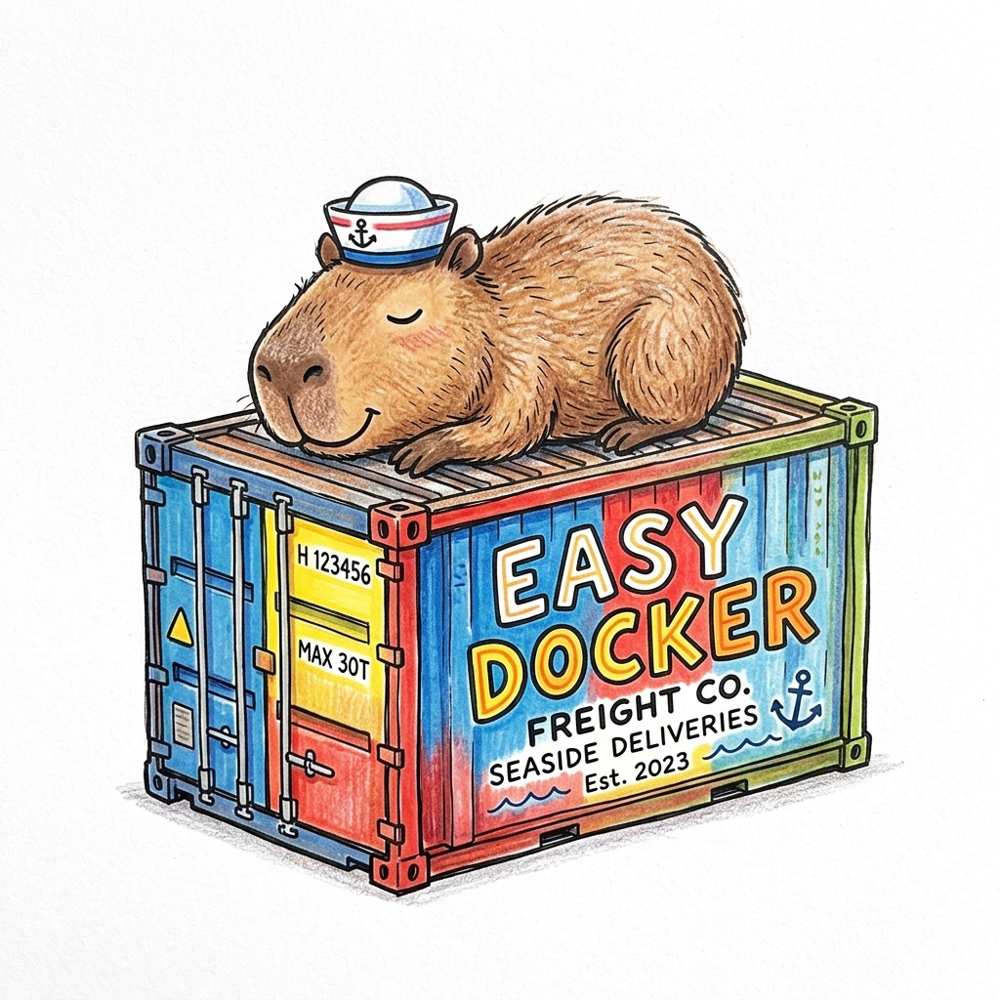

# 🐳 Easy Docker

<p align="center">
  
</p>

> A fast, lightweight, and modern Terminal User Interface (TUI) for managing Docker containers built in Rust.


> [!NOTE]
> 🔒 **Private Repository**: This project is currently in active internal development.

---

## ✨ Features

- 📁 **Docker Compose Auto-Grouping**: Automatically detects and groups containers by Docker Compose project labels. Collapse and expand groups seamlessly.
- ⚡ **Asynchronous & Responsive**: Built on `tokio` and `bollard` (Docker API client) for instant, non-blocking UI interactions.
- 🖱️ **Mouse & Keyboard Native**: Full mouse support (click to select/toggle) alongside vim-style (`j`/`k`) and arrow key navigation.
- 🛠️ **Container Lifecycle Management**:
  - **Start** (`s`) — Start stopped containers.
  - **Stop** (`x`) — Gracefully stop active containers.
  - **Restart** (`r`) — Restart running containers.
  - **Delete** (`d`) — Gracefully stop and remove containers.
- 🔍 **Container Inspector**: Real-time inspection panel displaying Container ID, Name, Image, State, Status, Command, and Mapped Ports.
- 🗂️ **Tabbed Views**: Quick tab navigation (`1-5` or `Tab`) for Containers, Images, Volumes, Networks, and System.
- 🔔 **Toast Notifications**: Non-disruptive feedback panel displaying status messages during async operations.

---

## ⌨️ Controls & Shortcuts

| Key / Input | Action |
| :--- | :--- |
| **`↑` / `↓`** or **`k` / `j`** | Navigate through container list |
| **Left Click** | Select container or toggle Compose group |
| **`Space`** / **`Enter`** | Expand or collapse Docker Compose project group |
| **`1` - `5`** / **`Tab`** | Switch active tabs (*Containers, Images, Volumes, Networks, System*) |
| **`s`** | **Start** selected container |
| **`x`** | **Stop** selected container |
| **`r`** | **Restart** selected container |
| **`d`** | **Delete** selected container (gracefully stops first) |
| **`q`** | **Quit** application |

---

## 🚀 Getting Started

### Prerequisites

- **Rust** (2024 edition or newer)
- **Docker Engine** running locally with standard Unix socket (`/var/run/docker.sock`) or default Windows pipe.

### Building & Running

1. **Clone the repository** (requires private access):
   ```bash
   git clone git@github.com:brunopassosaun/easy-docker.git
   cd easy-docker
   ```

2. **Run in development mode**:
   ```bash
   cargo run
   ```

3. **Build optimized release binary**:
   ```bash
   cargo build --release
   ```
   The binary will be generated at `./target/release/easy-docker`.

---

## 🏗️ Architecture

`easy-docker` is structured using a modular component architecture:

```
src/
├── main.rs                  # TUI initialization, event loop & input handling
├── models/
│   └── app.rs              # Root App state coordinator
├── components/
│   ├── mod.rs
│   └── containers.rs       # ContainersTab (state, table rendering logic, Docker actions)
├── services/
│   └── docker.rs           # Asynchronous Docker API service methods (bollard)
└── ui/
    └── ui.rs               # Ratatui layout rendering (Header, Tabs, Inspector, Help Panel)
```

---

## 🔒 Status & Licensing

This project is currently **Private & Unreleased** (internal pre-release). License terms will be updated prior to public release.
